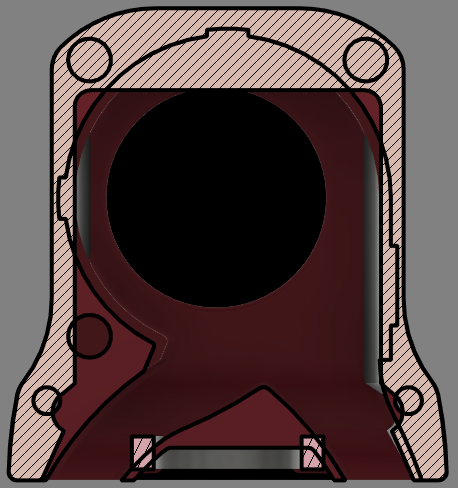
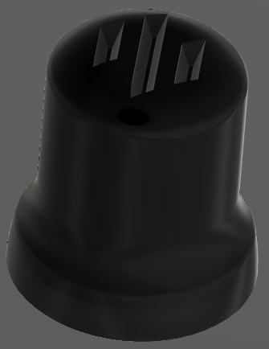
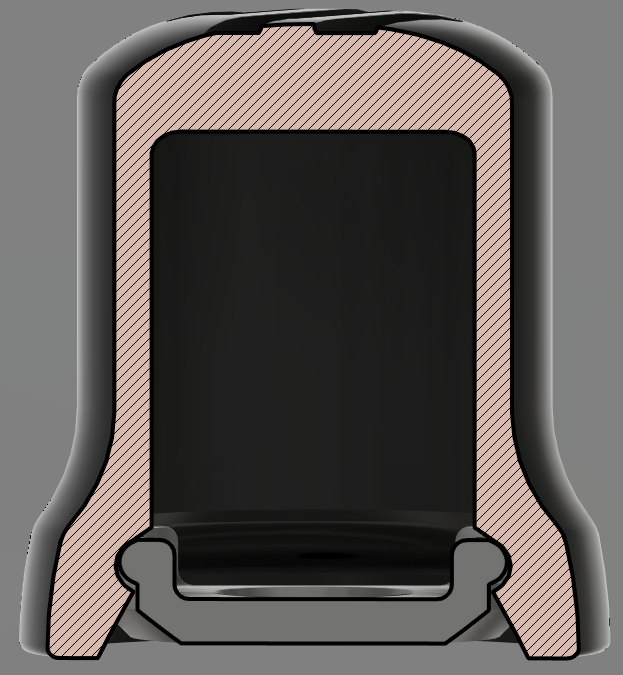
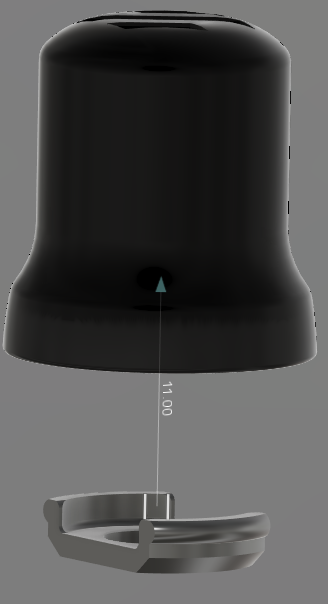
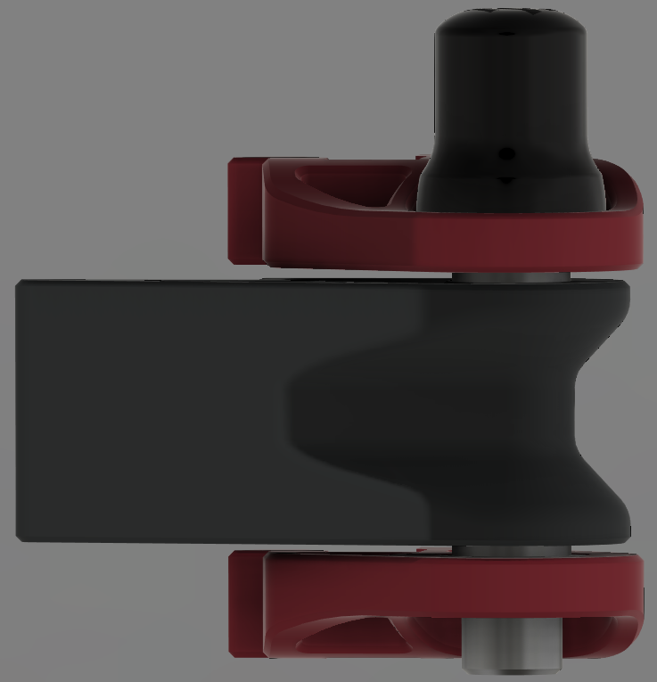
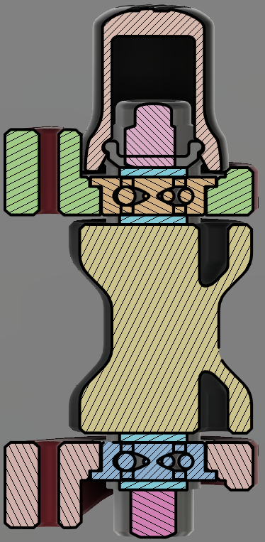
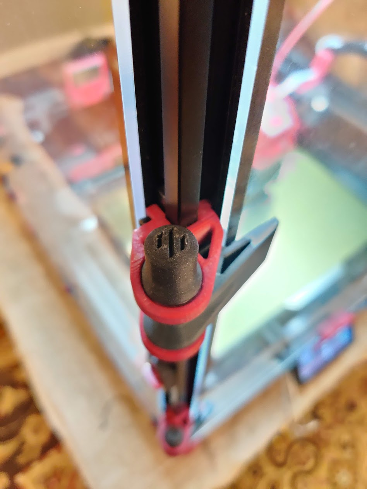
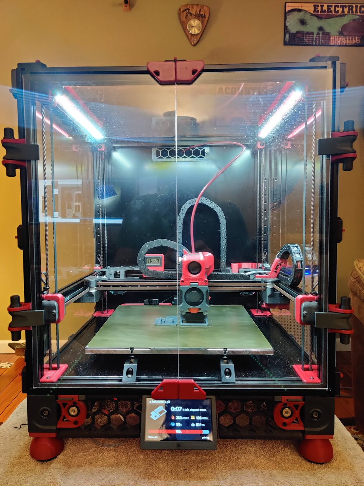
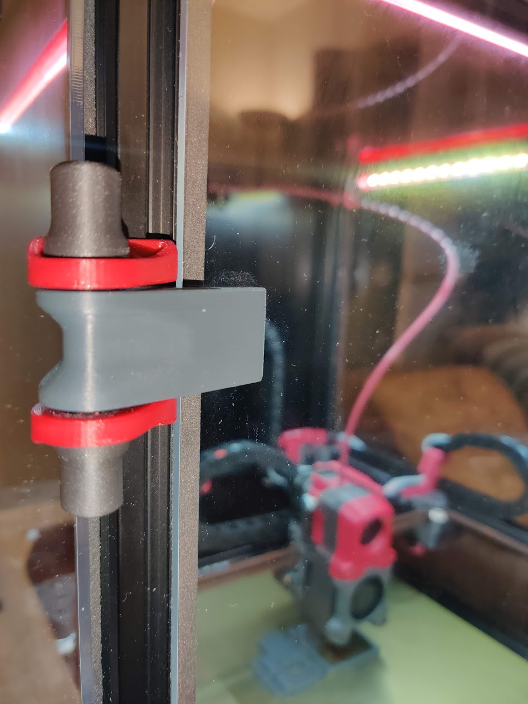

# Annex Engineering Denali Hinge Caps
These add some Voron flair to the [Annex Engineering Denali Hinges](https://github.com/Annex-Engineering/Denali/tree/master/STLs/Panel_Mounting/Front_Panel_Hinges_and_Locks/Hinges).  Designed to the profile of the Afterburner.  I loved the look and function of the Denali hinges, but thought the screw head and nut sticking out ruined the symmetry.  These fix that.

    
    
    
    
    
    
    
    
    

## Parts Required*
| Part | Quantity | Comment|
|------|------|--------|
| M5 X 40 SHCS | 1 | |
| M5 Nut | 1 | I used lock nuts |
| M5 Washer | 4 | 10mm OD at most -- I used the printed version |
*Per hinge

## Printing
- Print using standard Voron part settings and in the orientation used in the STL
  - Essentially you want all walls
- Print at least the cap and cap retainer
- I also included a washer as I didn't have any with a small enough OD.  They would rub on the bearing race making the swing not smooth.
  - Face the raised part of the washer towards the bearing
  - 4 washers per hinge

## Installation
- Remove the bolt from the hinge
- Install a cap retainer onto the screw facing up towards the socket head
- Install a washer onto the screw with the raised portion away from the socket head
- Insert the screw in the top bearing and hinge frame
- Install a washer onto the screw with the raised portion towards the bearing
- Install the hinge arm on the screw in the orientation required for the side you're on
- Install a washer onto the screw with the raised portion away from the socket head
- Insert the screw in the bottom bearing and hinge frame
- Install a washer onto the screw with the raised portion towards the bearing
- Install a cap retainer onto the screw facing away from the bearing
- Screw on the nut
- Install the hinge onto the frame and doors
- Snap the caps onto the retainers